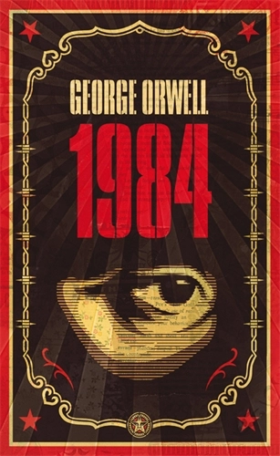
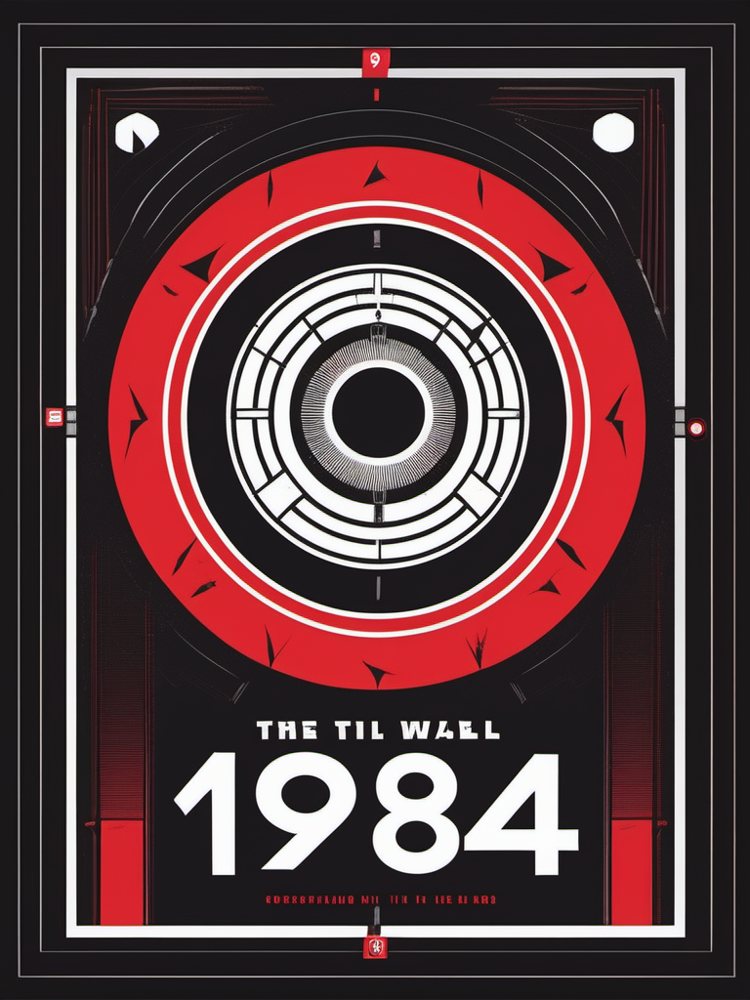
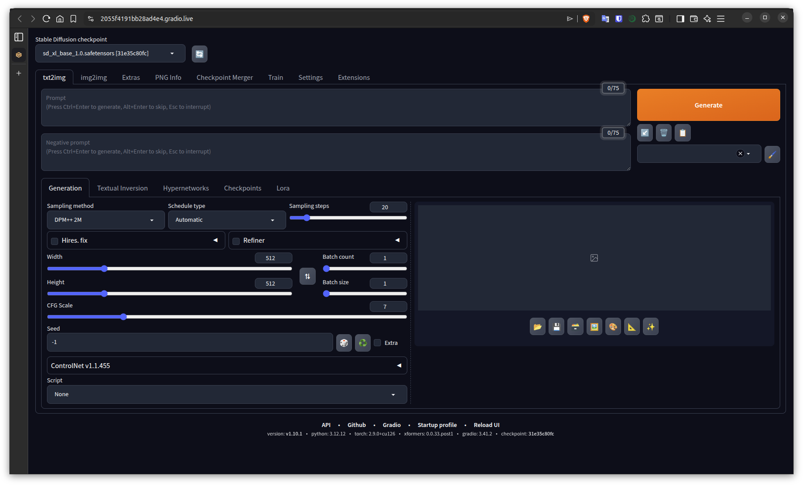
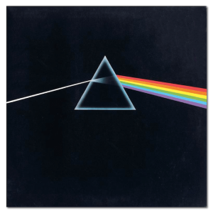
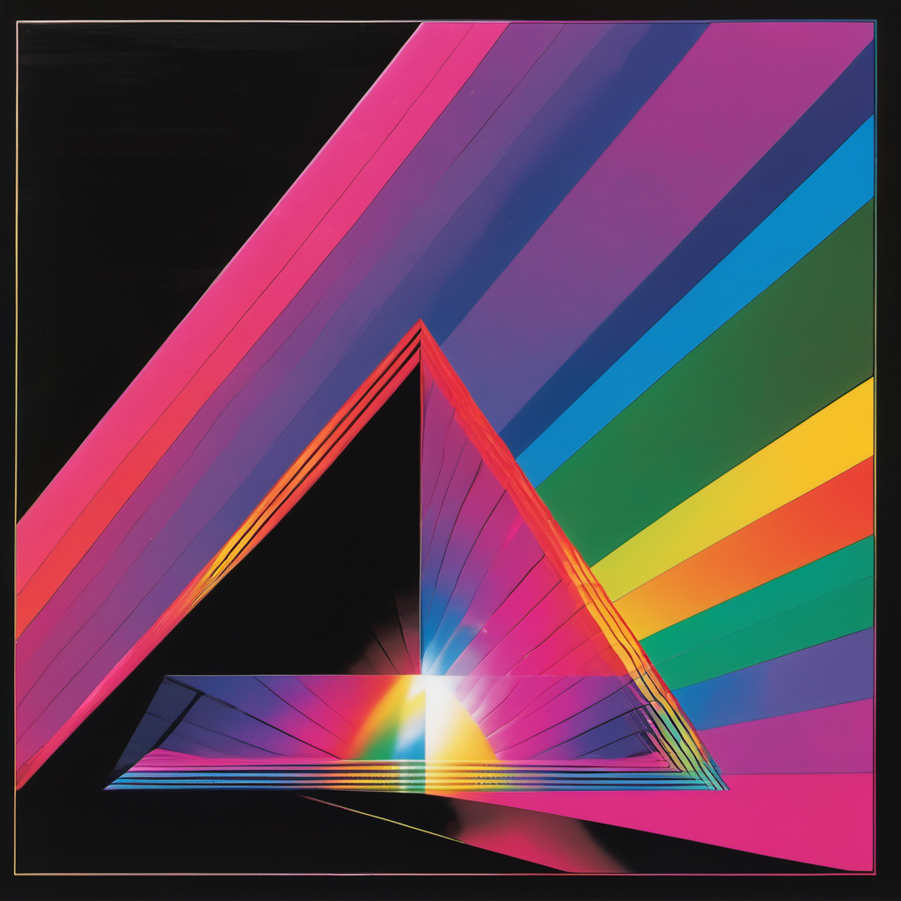
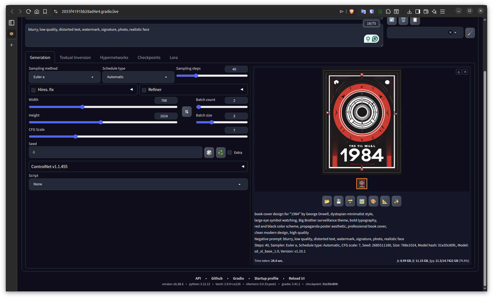
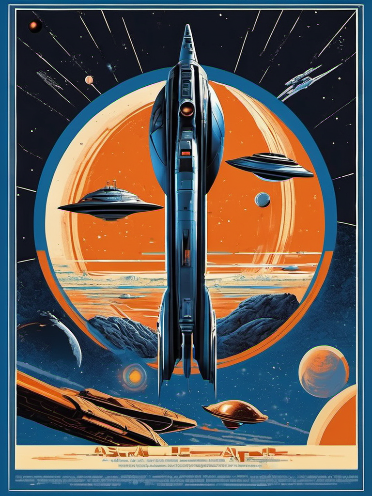

# AI-Generated Media Covers

Redesign of iconic media covers using Stable Diffusion XL.

---

## 1. Book: 1984 by George Orwell

### Original


### AI-Generated Variation


### Workflow

**Image Generation Model:**
- Name: Stable Diffusion XL Base 1.0
- Version: SDXL 1.0
- Link: https://huggingface.co/stabilityai/stable-diffusion-xl-base-1.0

**LoRAs/Adapters/Extensions:**
- None

**Technical Generation Details:**
- Sampling Steps: 30
- CFG Scale: 7
- Sampler: DPM++ 2M Karras
- Resolution: 768 x 1024
- Seed: -1

**Prompt:**
```
book cover design for "1984" by George Orwell, dystopian minimalist style, 
large eye symbol watching, Big Brother surveillance theme, bold typography, 
red and black color scheme, propaganda poster aesthetic, professional book cover, 
clean modern design, high quality
```

**Negative Prompt:**
```
blurry, low quality, distorted text, watermark, signature, photo, realistic face
```

**Pipeline Screenshot:**


**Resources Used:**
- WebUI: Automatic1111 Stable Diffusion WebUI
- Platform: Google Colab (Free Tier)
- Hardware: Tesla T4 GPU, 15GB VRAM
- Runtime: Cloud-based

---

## 2. Album: Pink Floyd - Dark Side of the Moon

### Original


### AI-Generated Variation


### Workflow

**Image Generation Model:**
- Name: Stable Diffusion XL Base 1.0
- Version: SDXL 1.0
- Link: https://huggingface.co/stabilityai/stable-diffusion-xl-base-1.0

**LoRAs/Adapters/Extensions:**
- None

**Technical Generation Details:**
- Sampling Steps: 30
- CFG Scale: 7
- Sampler: DPM++ 2M Karras
- Resolution: 1024 x 1024
- Seed: -1

**Prompt:**
```
album cover art, psychedelic prism refracting light into rainbow spectrum, 
geometric minimalist design, black background, light beam through glass prism, 
professional music album artwork, Pink Floyd style, clean composition, 
high quality, vintage 1970s aesthetic
```

**Negative Prompt:**
```
blurry, text, words, watermark, signature, cluttered, low quality
```

**Pipeline Screenshot:**


**Resources Used:**
- WebUI: Automatic1111 Stable Diffusion WebUI
- Platform: Google Colab (Free Tier)
- Hardware: Tesla T4 GPU, 15GB VRAM
- Runtime: Cloud-based

---

## 3. Movie: Star Wars

### Original


### AI-Generated Variation


### Workflow

**Image Generation Model:**
- Name: Stable Diffusion XL Base 1.0
- Version: SDXL 1.0
- Link: https://huggingface.co/stabilityai/stable-diffusion-xl-base-1.0

**LoRAs/Adapters/Extensions:**
- None

**Technical Generation Details:**
- Sampling Steps: 30
- CFG Scale: 7
- Sampler: DPM++ 2M Karras
- Resolution: 768 x 1024
- Seed: -1

**Prompt:**
```
movie poster design, Star Wars style, epic space opera aesthetic, 
dramatic composition with starships and planets, vintage 1970s sci-fi poster art, 
blue and orange color scheme, professional film poster, cinematic lighting, 
high quality artwork
```

**Negative Prompt:**
```
faces, people, characters, text, logos, blurry, low quality, watermark
```

**Pipeline Screenshot:**


**Resources Used:**
- WebUI: Automatic1111 Stable Diffusion WebUI
- Platform: Google Colab (Free Tier)
- Hardware: Tesla T4 GPU, 15GB VRAM
- Runtime: Cloud-based

---

## Summary

All covers were generated using Stable Diffusion XL 1.0 on Google Colab's free tier with Tesla T4 GPU. The self-hosted solution was accessed via Automatic1111 WebUI running in a Colab notebook environment.

**Total Generation Time:** ~5-10 minutes (across all 3 images)  
**Cost:** Free (Google Colab free tier)  
**Date:** February 9, 2026

## Project Structure
```
ai-media-covers/
├── README.md
├── results/
│   ├── 1984_ai_generated.png
│   ├── 1984_original.jpg
│   ├── darkside_ai_generated.png
│   ├── darkside_original.png
│   ├── starwars_ai_generated.png
│   └── starwars_original.jpg
└── screenshots/
    ├── logs.png
    ├── screenshot1.png
    └── screenshot2.png
```
```
