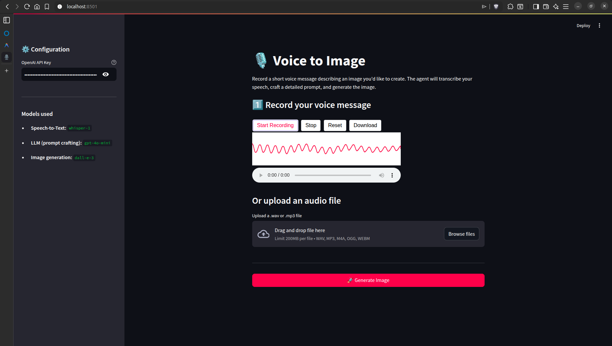
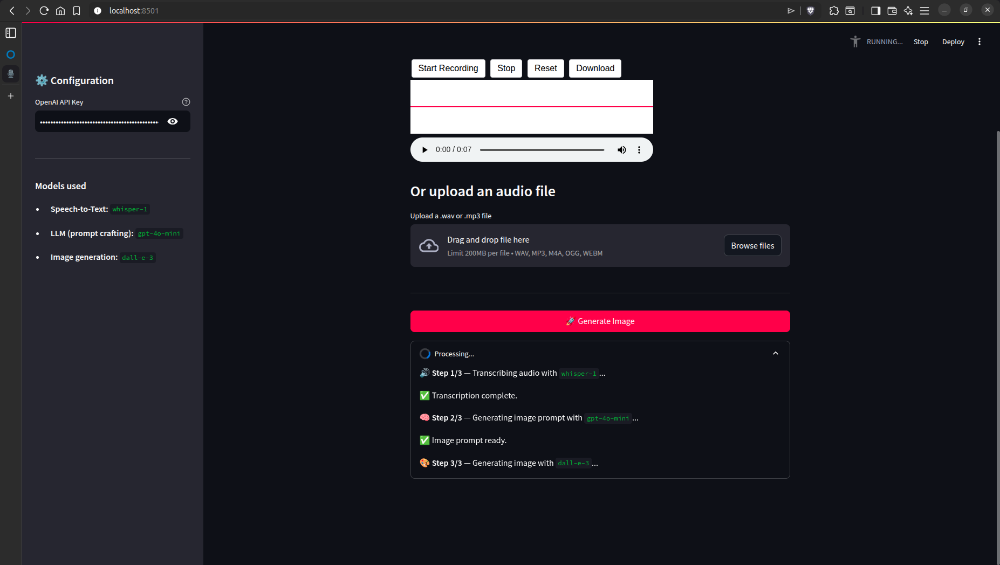
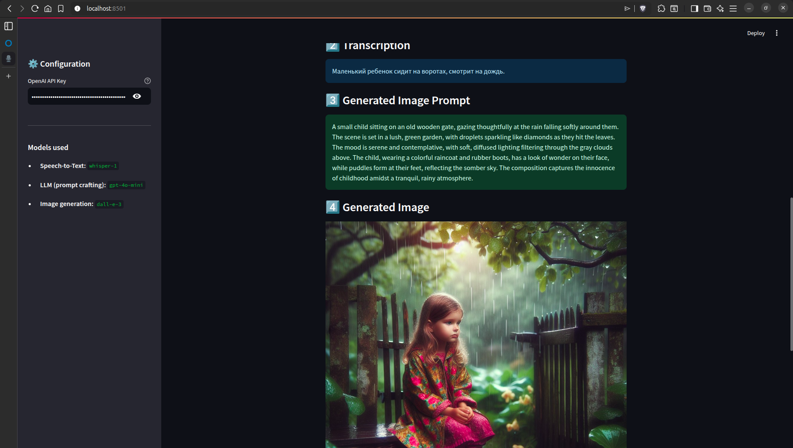
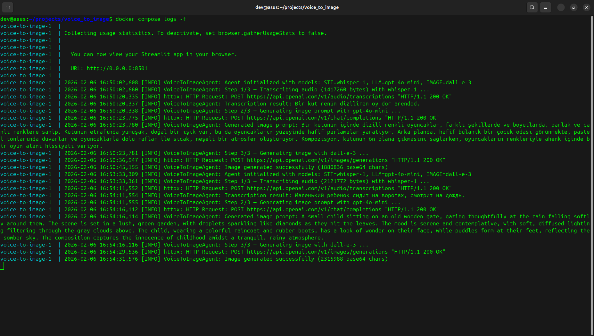

# 🎙️ Voice to Image

An AI-powered application that converts voice messages into images. Speak your idea, and the agent will transcribe it, craft a detailed image prompt, and generate the picture.

## Architecture

The application uses a three-step agent pipeline:

```
Voice Input → [Whisper] → Transcript → [GPT-4o-mini] → Image Prompt → [DALL-E 3] → Image
```

| Step | Model | Purpose |
|------|-------|---------|
| 1. Speech-to-Text | `whisper-1` | Transcribes the recorded voice message |
| 2. Prompt Generation | `gpt-4o-mini` | Converts the transcript into a detailed, vivid image prompt |
| 3. Image Generation | `dall-e-3` | Generates a 1024×1024 image from the prompt |

## Setup

### Prerequisites

- **Docker** (recommended) — or Python 3.9+
- OpenAI API key ([get one here](https://platform.openai.com/api-keys))

### Configure your API key

Copy the example env file and add your key:
```bash
cp .env.example .env
```
Then edit `.env` and set your OpenAI API key:
```
OPENAI_API_KEY=sk-your-api-key-here
```

Alternatively, you can paste the key directly in the app sidebar.

---

### Option 1 — Run with Docker (recommended)

```bash
docker compose up --build
```

The app will be available at `http://localhost:8501`.

To stop:
```bash
docker compose down
```

### Option 2 — Run locally

1. **Clone the repository**
   ```bash
   git clone https://github.com/<your-username>/voice-to-image.git
   cd voice-to-image
   ```

2. **Create a virtual environment**
   ```bash
   python -m venv venv
   source venv/bin/activate  # Linux/Mac
   # or
   venv\Scripts\activate     # Windows
   ```

3. **Install dependencies**
   ```bash
   pip install -r requirements.txt
   ```

4. **Run the app**
   ```bash
   streamlit run app.py
   ```

   The app will open at `http://localhost:8501`.

## Usage Workflow

### Step 1 — Record or Upload Audio

Open the app and either record a voice message using the built-in recorder, or upload an audio file (.wav, .mp3, .m4a, .ogg, .webm).



### Step 2 — Click "Generate Image"

Press the **Generate Image** button. The agent processes your request through the three-step pipeline. Progress is displayed in real-time.



### Step 3 — View Results

The app displays all intermediate data:
- **Transcription** — what the agent heard
- **Image prompt** — the detailed description sent to DALL-E 3
- **Generated image** — the final result
- **Pipeline summary** — all models used



### Console Logs

The agent prints detailed logs to the console at every step:



## Project Structure

```
voice-to-image/
├── app.py              # Streamlit UI
├── agent.py            # Voice-to-Image agent pipeline
├── requirements.txt    # Python dependencies
├── Dockerfile          # Docker image definition
├── docker-compose.yml  # Docker Compose config
├── .dockerignore       # Files excluded from Docker build
├── .env.example        # Environment variable template
├── .gitignore
├── screenshots/        # Usage screenshots for README
└── README.md
```

## Tech Stack

- **UI**: [Streamlit](https://streamlit.io/) + [streamlit-audiorec](https://github.com/stefanrmmr/streamlit-audio-recorder)
- **Speech-to-Text**: [OpenAI Whisper](https://platform.openai.com/docs/guides/speech-to-text)
- **LLM**: [OpenAI GPT-4o-mini](https://platform.openai.com/docs/models)
- **Image Generation**: [OpenAI DALL-E 3](https://platform.openai.com/docs/guides/images)
- **Containerization**: [Docker](https://www.docker.com/)
- **Language**: Python 3.12
